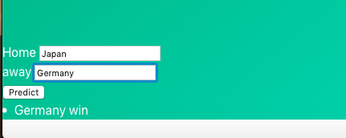

<p align="center"><p>

&nbsp;&nbsp;&nbsp;&nbsp;&nbsp;&nbsp;&nbsp;&nbsp;&nbsp;&nbsp;&nbsp;&nbsp;&nbsp;
&nbsp;&nbsp;&nbsp;&nbsp;&nbsp;&nbsp;&nbsp;&nbsp;&nbsp;&nbsp;&nbsp;&nbsp;&nbsp;


[](https://github.com/anfederico/flaskex/issues)

[](https://opensource.org/licenses/MIT)
[](https://www.codacy.com/app/RDCH106/Flaskex?utm_source=github.com&amp;utm_medium=referral&amp;utm_content=RDCH106/Flaskex&amp;utm_campaign=Badge_Grade)

<br><br>

<p align="center"><p>

<p align="center"><p>
<p align="center"><p>

## Features
- Based on FlaskEX
- New! Stripe integrated
- New! Soccer winner prediction using linear regression model

## Setup
```
For local
  git clone https://github.com/anfederico/Flaskex
  cd Flaskex
  pip install -r requirements.txt
  python app.py

For render.com
  Build command   pip install -r requirements.txt
  Start command   gunicorn app:app
```

## Contributing
Please take a look at our [contributing](https://github.com/anfederico/Flaskex/blob/master/CONTRIBUTING.md) guidelines if you're interested in helping!
